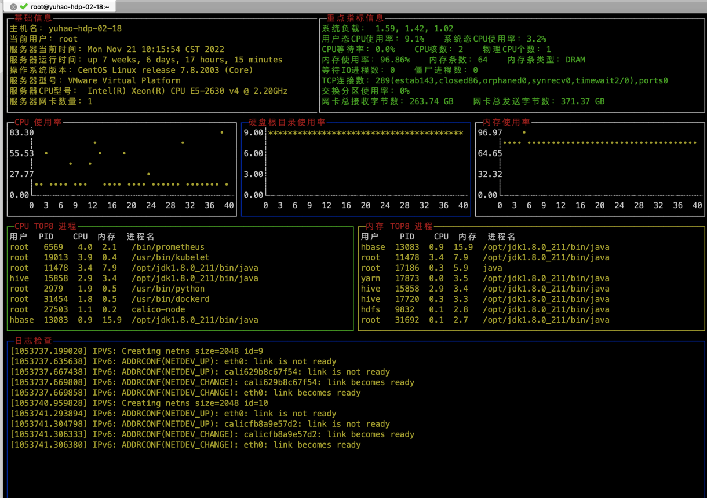

### 使用说明
```shell
    # 1. 下载
    git clone https://github.com/nokikyoar/dashSystem.git
    # 2. 编译
    cd dashsystem
    CGO_ENABLED=0 GOOS=linux GOARCH=amd64 go build -o dashsystem
    # 3. 运行
    ./dashsystem
```
或者直接下载编译好的二进制文件运行即可

### Implemented functions
- [x] redhat系 系统基础信息查看
- [x] redhat系 指标信息查看
- [x] redhat系 CPU、内存、硬盘、网络、进程、日志等指标监控

### Future implementation
- [ ] 通过采用参数的形式来对于诸如时间间隔，颜色，指定日志输出等进行设置
- [ ] 将shell的部分全部用go语言实现，这样可以适用于所有linux系统
- [ ] 通过参数实现屏幕切换，比如CPU专题、内存专题、网络专题等
